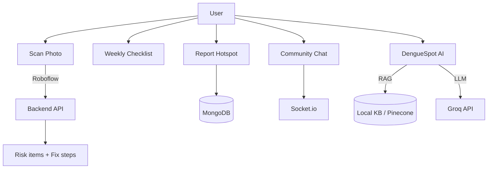

## 🦟 DengueSpot — Community Dengue Prevention App

A full‑stack web app that helps households remove mosquito breeding sites, report neighborhood hotspots, and get faster community action. Built for seasonal dengue risk (Bihar) and scalable as a startup.

---

## Features

- **📸 Scan area (AI)**: Upload a photo; backend calls Roboflow model; app highlights risky items and suggests quick fixes.
- **✅ Weekly checklist**: Weekly “empty / clean / cover” actions and solid‑waste cleanup with progress tracking.
- **🗺️ Hotspot map**: Report stagnant‑water spots with location + (optional) photo; community sees hotspots (no personal info shown).
- **🤖 DengueSpot AI (chatbot)**: Dengue Q&A assistant (Groq + RAG retrieval). Falls back to local knowledge if Pinecone is not set.
- **💬 Community chat (real‑time)**: Area/city chat rooms using Socket.io.
- **🌦️ Weather alert**: Weather‑based risk signal (API‑based; key optional).
- **🏆 Leaderboard**: Reporter rankings / community points.
- **📰 News ticker**: Dengue news feed UI.
- **🔐 Login**: JWT auth + optional Google OAuth.
- **🛡️ Admin portal**: Admin moderation tools (where enabled).

---

## Screenshots / visuals (add yours here)

Create this folder and add screenshots, then update the paths:

- `docs/screenshots/01-scan.png`
- `docs/screenshots/02-checklist.png`
- `docs/screenshots/03-hotspots.png`
- `docs/screenshots/04-chatbot.png`
- `docs/screenshots/05-community-chat.png`
- `docs/screenshots/06-weather.png`
- `docs/screenshots/07-leaderboard.png`


---

## App flow (simple)



---

## Tech stack

- **Frontend**: React (in `client/`)
- **Backend**: Node.js + Express (`server.js`)
- **DB**: MongoDB (Atlas recommended)
- **Cache / session / chat memory**: Redis (Upstash recommended)
- **Real‑time**: Socket.io (community chat)
- **AI vision**: Roboflow hosted model
- **AI chatbot**: Groq (LLM) + retrieval (Pinecone optional; local fallback available)
- **Maps**: React Leaflet + OpenStreetMap
- **Optional uploads**: Cloudinary (recommended on Render)

---

## Run locally (laptop)

1. **Install dependencies**
   ```bash
   npm run install-all
   ```

2. **Create `.env` in project root**
   - Copy `env.example` → `.env` and fill what you have.
   - Minimum to start the server: `PORT=5000`
   - For full features, set the keys in `env.example` (MongoDB, Redis, JWT, Roboflow, Groq/Pinecone, etc.)

3. **Development mode (recommended)**
   - Terminal 1 (backend):
     ```bash
     npm run dev
     ```
   - Terminal 2 (frontend):
     ```bash
     cd client
     npm start
     ```
   - Open: `http://localhost:3000`

4. **Single‑server mode (production‑style)**
   ```bash
   cd client
   npm run build
   cd ..
   npm start
   ```
   - Open: `http://localhost:5000`

---


##  Backend on Render, frontend on GitHub Pages

If you want the React app as a static site on GitHub Pages and only the API on Render:

### 1. Backend on Render

- Use the **same steps as above**, but:
  - You can skip `npm run build` in Render build command (optional optimisation):
    ```bash
    npm install
    ```
  - **Start command** remains:
    ```bash
    node server.js
    ```
- After deploy, note your API base URL, e.g.:
  - `https://denguespot-api.onrender.com`

Make sure `client/src/components/ScanArea.js`, `Checklist.js`, `HotspotMap.js`, and `Lessons.js` point to the correct API base URL. For example, set:

```bash
REACT_APP_API_URL=https://denguespot-api.onrender.com/api
```

in a `.env` file inside `client/` before building the frontend.

### 2. Frontend on GitHub Pages (from `client/`)

1. Inside `client/package.json`, add (if you want GitHub Pages):
   ```json
   "homepage": "https://<your-username>.github.io/<your-repo-name>/"
   ```
2. Install the deploy helper:
   ```bash
   cd client
   npm install --save-dev gh-pages
   ```
3. Add scripts in `client/package.json`:
   ```json
   "scripts": {
     "predeploy": "npm run build",
     "deploy": "gh-pages -d build",
     ...
   }
   ```
4. Deploy:
   ```bash
   cd client
   npm run deploy
   ```
5. GitHub Pages will host the built React app at the `homepage` URL.

Frontend will call the backend on Render using `REACT_APP_API_URL`.

---

## Project structure (MVP)

```text
denguespot/
├── server.js           # Express backend (scan, checklist, hotspots, lessons)
├── package.json        # Backend scripts + deps
├── .env                # Local env vars (not committed)
├── env.example/.env.example
├── RUN_ME_FIRST.txt
├── SETUP.md
├── QUICKSTART.md
├── PROJECT_SUMMARY.md
└── client/
    ├── package.json
    ├── public/
    │   └── index.html
    └── src/
        ├── App.js
        └── components/
            ├── Header.js
            ├── ScanArea.js
            ├── Checklist.js
            ├── HotspotMap.js
            └── Lessons.js
```

---

## Notes for adding a real database later

- This repo already supports MongoDB + Redis. Use `env.example` to configure it.

